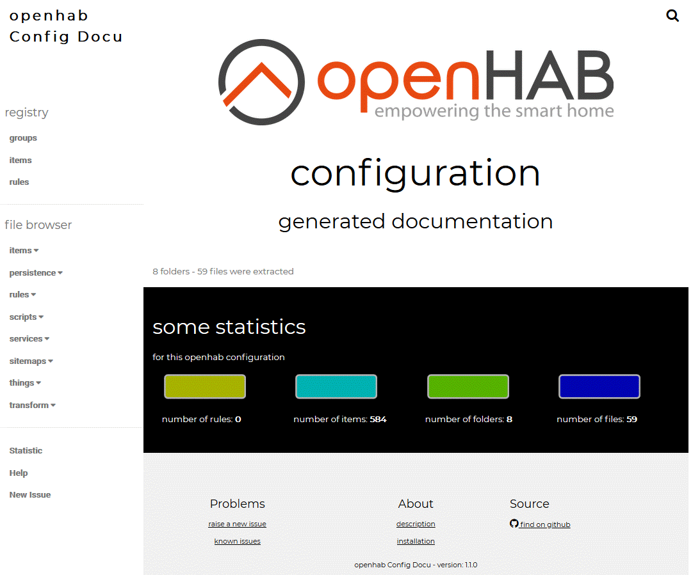
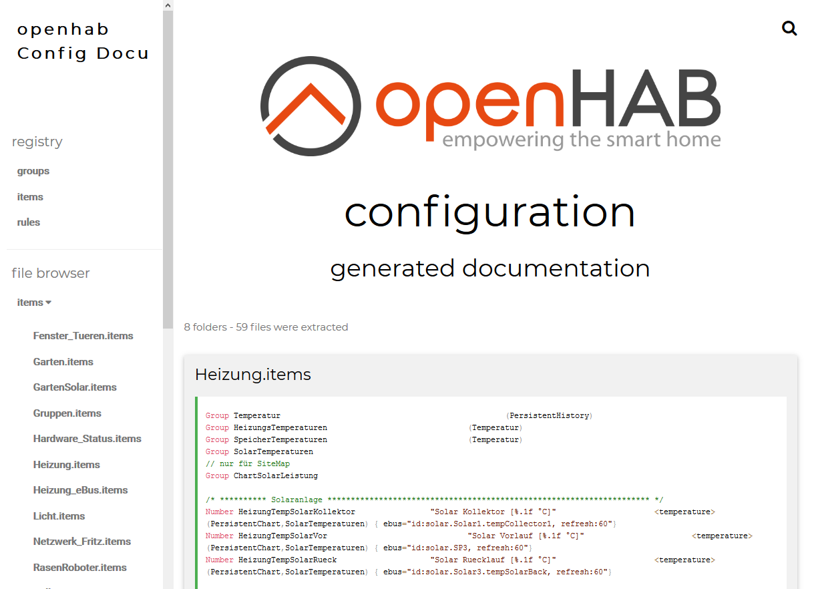

# openhabConfigDocGen

- [openhabConfigDocGen](#openhabconfigdocgen)
  - [Description](#description)
  - [Actual features](#actual-features)
  - [ToDo's](#todos)
  - [Screenshots](#screenshots)
    - [home screen](#home-screen)
    - [example for items](#example-for-items)
  - [Usage](#usage)
  - [Installation](#installation)
    - [Prerequisites](#prerequisites)
    - [Download & Install](#download--install)
  - [Debugging](#debugging)
    - [execute with debugging on](#execute-with-debugging-on)
      - [Linux - OSX](#linux---osx)
      - [Windows CMD](#windows-cmd)
      - [Windows PowerShell](#windows-powershell)
  - [Testing](#testing)

## Description

A tool to generate a good looking browserable overview for your own openhab configuration.
In the first step only for the data in config files. Planned for future, to get all information of the database of openhab too. (e.g. thing configuration)

## Actual features
- basic html/ css/ js - template integrated for customization
- grab the given folder recursivly for known openhab config file formats
- show the folder/ file structure in the navigation tree with expand/ collpase
- show the content of each file on site with code highlighting

## ToDo's
- ~~highlighting for ESH Code~~
- searching the files for keywords
- cluster the hierarchy of rules, groups, items
- ...

## Screenshots

### home screen

### example for items

## Usage

to execute the generator start with the following command:

    node ohConfigDocGen.cli.js <srcfolder_of_openhab_config> <targetfolder_for_output>

## Installation

### Prerequisites

This tool require node.js. To use it, install [NPM JS](https://www.npmjs.com/get-npm "get npm from www.npmjs.com")

### Download & Install

1. clone/ fetch the [master branch](https://github.com/ohAnd/openhabConfigDocGen.git)
2. navigate to downloded folder
3. in commandline
        
        npm install ..\<yourdownloadfolder>\
    or
        
        npm install openhab_config_doc_gen

---

## Debugging

### execute with debugging on

#### Linux - OSX

    DEBUG=* node ohConfigDocGen.cli.js <srcfolder_of_openhab_config> <targetfolder_for_output>

#### Windows CMD

    set DEBUG=* & node ohConfigDocGen.cli.js <srcfolder_of_openhab_config> <targetfolder_for_output>
#### Windows PowerShell
    
    $env:DEBUG='*';node ohConfigDocGen.cli.js <srcfolder_of_openhab_config> <targetfolder_for_output>

## Testing
 t.b.d.